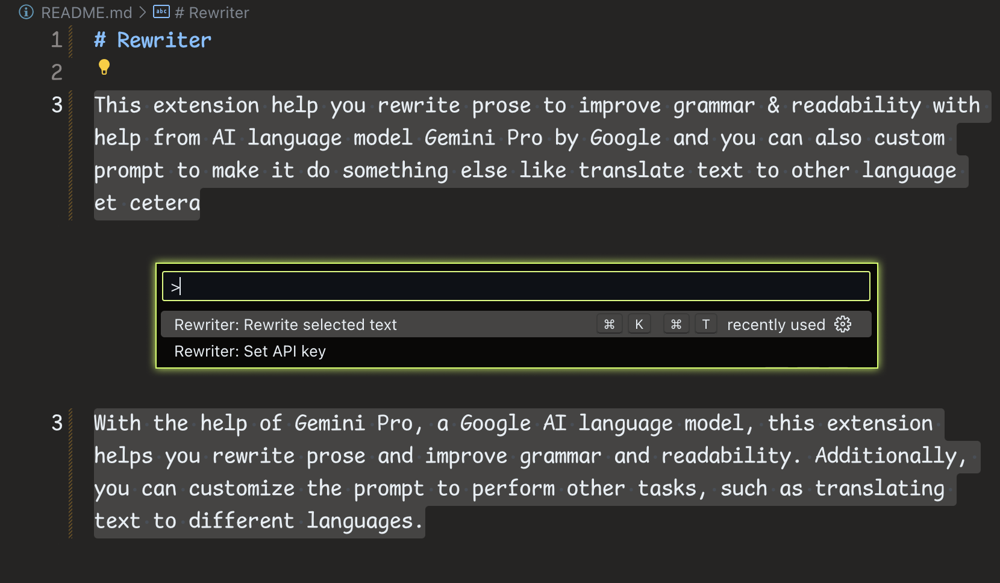

# Rewriter

With the help of Gemini Pro, a Google AI language model, this extension helps you rewrite prose and improve grammar and readability. Additionally, you can customize the prompt to perform other tasks, such as translating text to different languages.



This extension hasn't been published to the VS Code Marketplace yet. To use it, clone this repository and install it manually.

## Requirements

[You need an API key from Google AI Studio.](https://makersuite.google.com/app/prompts/new_freeform)

## Configuration

Run the command **Rewriter: Set API key**, and enter your API key.

## Usage

### With default prompt

To use the default prompt, select the text you want to rewrite and run the command **Rewriter: Rewrite Selected Text**.

### With customized prompt

To use a customized prompt, modify VS Code’s `keybindings.json` to create a keyboard shortcut for it.

For instance, this keybinding assists me in translating text into Thai while also enhancing the text's readability if it’s already in Thai:

```json
{
  "key": "cmd+k cmd+t",
  "command": "rewriter.rewrite",
  "args": {
    "debug": true,
    "prompt": "ช่วยทำให้ข้อความอ่านง่ายขึ้น และแก้คำผิดให้หน่อย หรือถ้าข้อความต้นฉบับมาเป็นภาษาอังกฤษ ให้แปลเป็นภาษาไทย",
    "examples": [
      {
        "input": "ไม่ว่าคุณจะทำงานสายอาชีพไหน ถ้าคุณเขียนโปรแกรมเป็น ก็เปรียบเสมือนมีเวทมนตร์หรือมีซุปเปอร์พาวเวอร์ติดตัว เพราะว่าคุณจะสามารถสั่งคอมพิวเตอร์ให้ทำในสิ่งที่คุณต้องการได้ ไม่ว่าจะเป็นการสร้างเว็บไซต์ สร้างแอพมือถือ สอนคอมพิวเตอร์ให้ทำงานที่น่าเบื่อจำเจแทนเรา ใช้สร้างชิ้นงานศิลปะ หรือสร้างเกม",
        "output": "ไม่ว่าคุณจะทำงานอะไร หากคุณเขียนโปรแกรมเป็น ก็เหมือนกับว่าคุณมีเวทมนตร์ หรือมีซุปเปอร์พาวเวอร์ติดตัว เพราะการเขียนโปรแกรมจะช่วยให้คุณสามารถสั่งให้คอมพิวเตอร์ทำในสิ่งที่คุณต้องการได้ เช่น สร้างเว็บไซต์ สร้างแอพมือถือ หรือสอนคอมพิวเตอร์ให้ทำงานที่น่าเบื่อแทนเรา คุณยังสามารถใช้โปรแกรมเพื่อสร้างงานศิลปะหรือสร้างเกมได้อีกด้วย"
      },
      {
        "input": "Oftentimes websites are designed using a desktop-first approach",
        "output": "ปกติหลายๆ ครั้งเวลาออกแบบหน้าเว็บ เรามักจะเริ่มจากการออกแบบหน้าเว็บสำหรับดูบนจอเดสก์ท็อปก่อน (desktop-first)"
      }
    ]
  }
}
```
